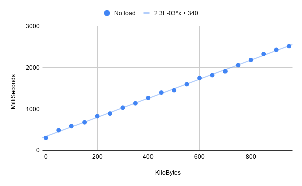
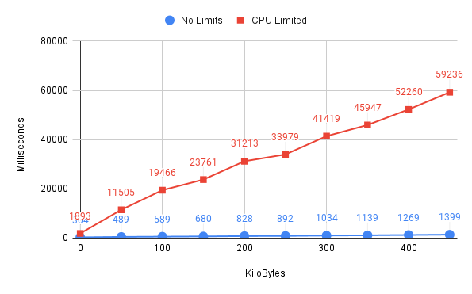

## Instructions
1. run `make` in TSS.CPP.
2. run `make`.

## Benchmarks

Both of these tests were run while limiting the total cpu usage to 50% in a 12-core cpu using `cpulimit -l 50 -i`.

### Change in Time With Size

Time increases by 1 ms every 5.12 KBs.

### With and Without Background Tasks

**stress-ng** was run in the background here.

`stress-ng --cpu 4 -t 7200`
